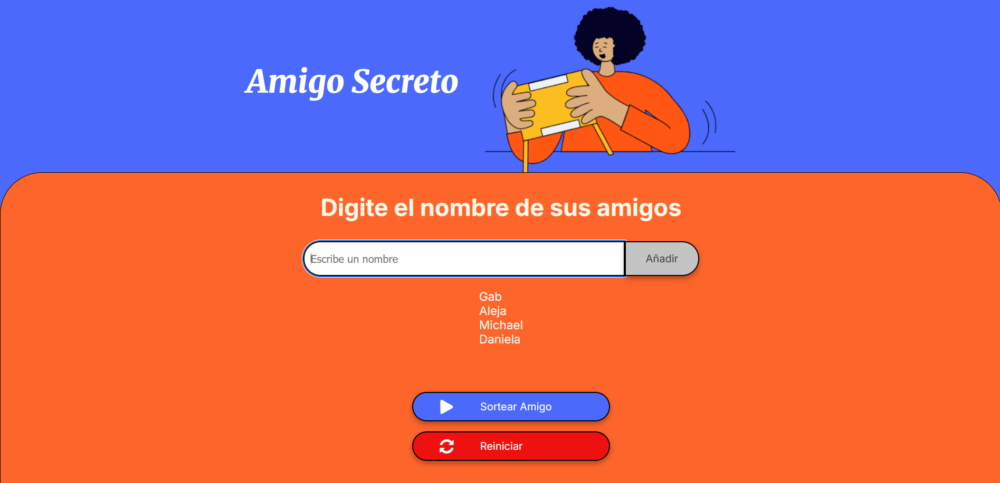
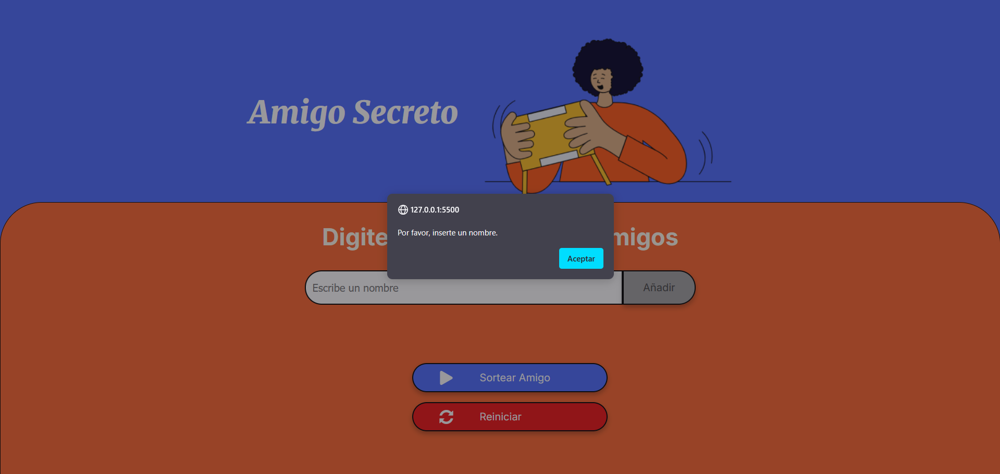
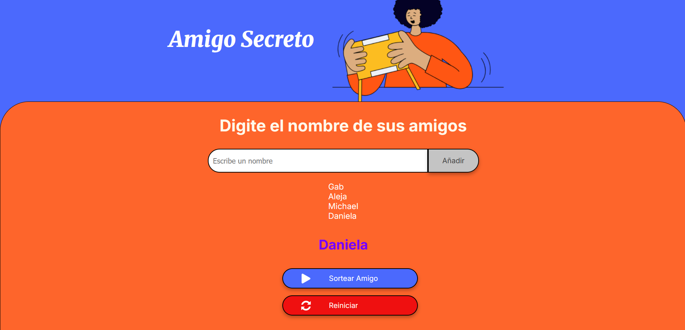
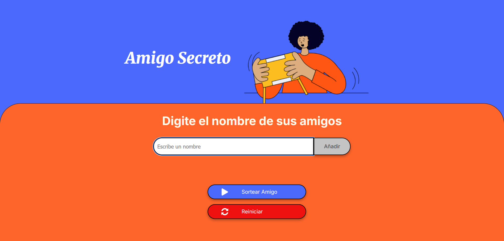

# Challenge Alura - Amigo Secreto.

Bienvenidos a mi propuesta para el challenge de amigo secreto para Alura Latam en el programa ONE Oracle Next Education!

El challenge propuesto consistía en crear las funcionalidades correspondientes para que la aplicación tuviera la función de ingresar los nombres de tus amigos y poder sortearlos para así jugar amigo secreto. Dichos nombres se escribirían en el input asignado y al añadirlos, estos se cargarían a una lista la cual podríamos sortear posteriormente.

Sin embargo, realicé ligeras modificaciones en la interfaz gráfica y en la dinámica de uso de la app, añadiendo nuevas funciones que mejoran la experiencia de usuario, permitiendo reiniciar el juego sin necesidad de recargar la página. 

## Los cambios propuestos por mi fueron:
- Hubo una ligera reorganización de los colores de la interfaz gráfica y se añadió el botón de `Reiniciar Juego` debajo del botón `Sortear Amigo`.
- Se añadió la función para que al pulsar el botón `Añadir` el cursor se activara nuevamente en la caja de texto de ingreso de amigos.
- Se añadió la función para que al presionar la tecla `Enter`, el texto ingresado en la caja de texto se procesara automáticamente.
- Se añadió la función de reiniciar el juego para poder empezarlo desde cero sin necesidad de recargar la página, mejorando la experiencia de usuario al utilizar la aplicación.

## Funcionalidades:

- **Agregar nombres y visualizarlos:** Los usuarios pueden ingresar nombres en el campo de texto correspondiente y hacer click en `Añadir` para agregarlos a la lista, también pueden utilizar la tecla `Enter` directamente, al añadir un nombre, este se mostrará en una lista debajo de la caja de texto para ingresar nombres.

   

- **Validación de entrada:** Si el campo de texto está vacío o contiene caracteres no válidos, el sistema mostrará una `alerta` 
solicitando un nombre válido.
 
   

- **Sorteo aleatorio:** Al hacer click en el botón `Sortear Amigo` el sistema seleccionará aleatoriamente un nombre de la lista y lo mostrará en pantalla.

   

- **Reiniciar Juego:** Al hacer click en el botón `Reiniciar Juego`, La lista se borrará automáticamente, y se podrá emprezar el juego desde cero ingresando nuevos nombres, así no deberás recargar la página cada que quieras jugar de nuevo!

   

### Pre-requisitos:

No necesitas herramientas adicionales para ejecutar este proyecto más que conexión a internet para descargar la aplicación y el navegador de tu preferencia en el cuál vas a ejeutar dicha aplicación. Si trabajas con Visual Studio Code, puedes utilizar la extensión [Live Server](https://marketplace.visualstudio.com/items?itemName=ritwickdey.LiveServer) para una experiencia de uso más fluida.

### Instalación:

1. Clona este repositorio en tu máquina local:
    ```bash
    git clone https://github.com/gabfbeats/challenge-amigo-secreto_esp-main.git
    ```

2. Navega al directorio del proyecto:
    ```bash
    cd challenge-amigo-secreto_esp-main
    ```

3. Abre el archivo `index.html` en tu navegador favorito para empezar a usar la aplicación.

**Alternativa:** Si lo deseas, simplemente puedes hacer click al inicio del repositorio en el botón `Code` en la parte superior de tu pantalla, luego hacer click en el botón `Download ZIP` y luego de descargar el proyecto, podrás descomprimir el archivo y hacer uso de este.

[Alternativa Descarga](./assets/readme_img/Alternativa-Descarga.png)

### Ejecución local:

Este proyecto no requiere ninguna instalación adicional. Simplemente abre el archivo `index.html` en tu navegador y empieza a usar la aplicación.

También puedes usar la extensión de Microsoft [Live Preview](https://marketplace.visualstudio.com/items?itemName=ms-vscode.live-server) en tu VSCode para interactuar con la aplicación.

**Importante:** Las alertas de navegador no son visibles dentro de la vista previa que proporciona esta extensión.

## Construido con:

- [HTML](https://developer.mozilla.org/en-US/docs/Web/HTML) - Para la estructura y diseño de la app.
- [CSS](https://developer.mozilla.org/en-US/docs/Web/CSS) - Para los estilos visuales.
- [JavaScript](https://developer.mozilla.org/en-US/docs/Web/JavaScript) - Para la lógica de la aplicación (agregar nombres, realizar el sorteo, reiniciar el juego y otras más).
# challenge-amigo-secreto_esp-main
